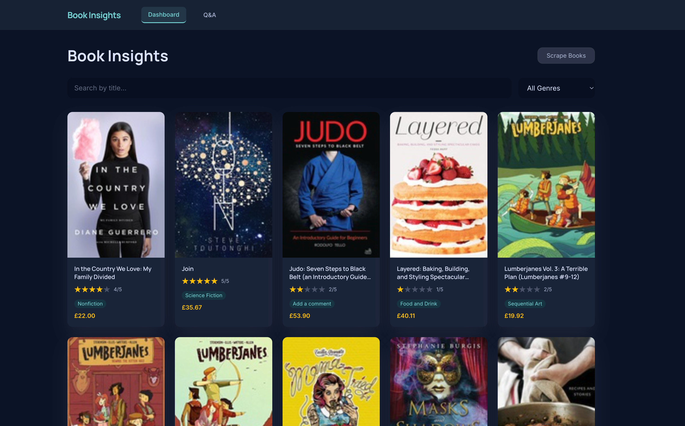
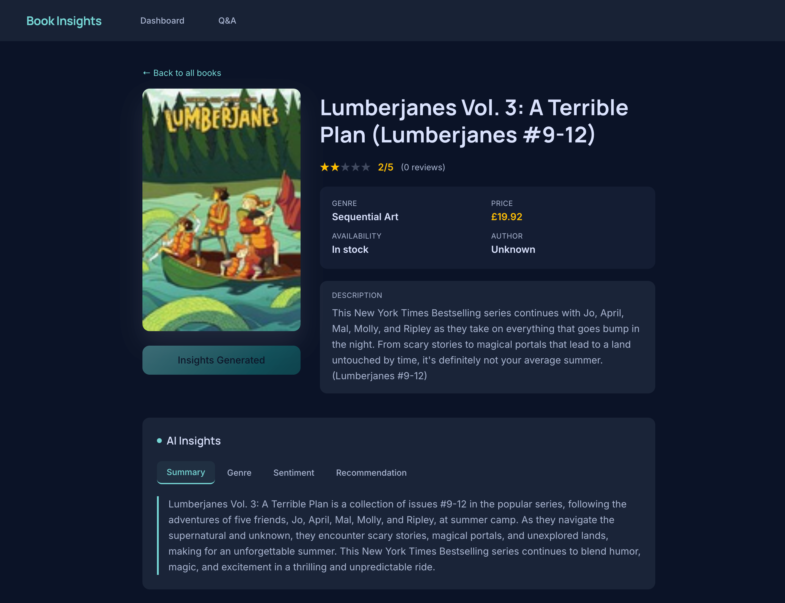
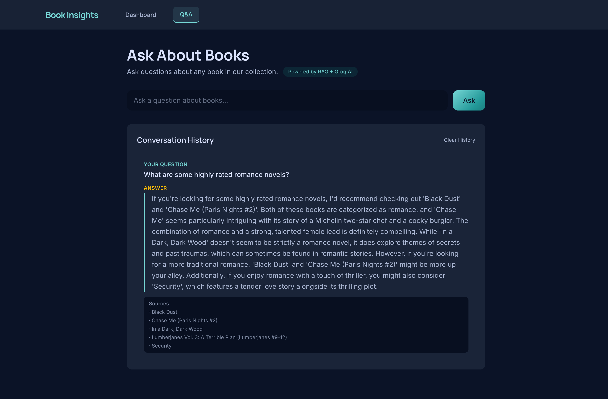
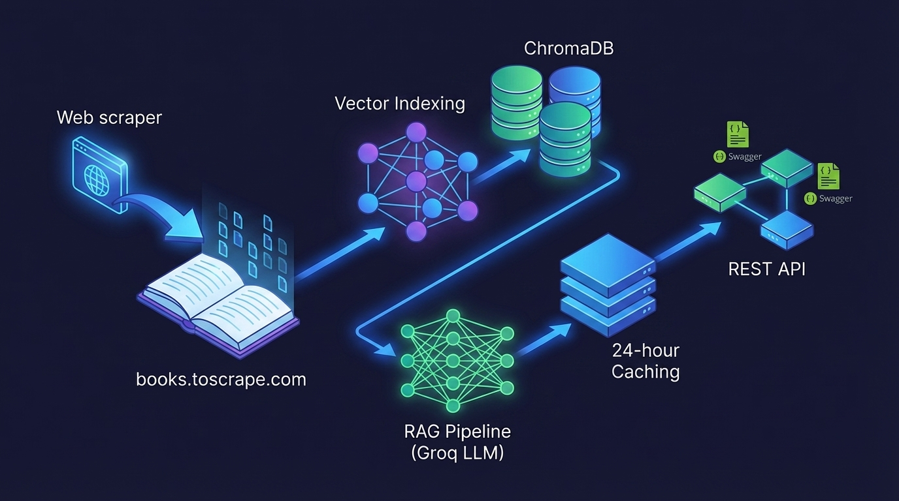

# 📖 Book Insight Platform

> AI-powered book RAG platform with intelligent insights & Q&A. Live at [ergosphere.shubhsomani.tech](https://ergosphere.shubhsomani.tech).

## Features

- **Book Scraping**: Selenium automation for book data collection
- **AI Insights**: Summaries, genre classification, recommendations, sentiment analysis
- **RAG Pipeline**: Context-aware Q&A with source citations
- **Vector Search**: Semantic book recommendations
- **REST APIs**: Full Swagger UI documentation
- **Modern UI**: React + Tailwind CSS

## Tech Stack

| Backend | Django, ChromaDB, Groq LLM |
| Frontend | React 18, Vite, Tailwind |
| Database | SQLite (metadata), ChromaDB (vectors) |
| Scraping | Selenium, BeautifulSoup |

## Quick Start

```bash
# Everything via Makefile
make help              # See all commands
make install          # Install dependencies
make setup            # Full setup (deps + migrations + index)
make scrape           # Scrape 2 sample books
make backend          # Run Django (port 8000)
make frontend         # Run React (port 5173)
make run              # Show both URLs
```

**First time**: `make setup`, then open two terminals: `make backend` & `make frontend`

## Setup Steps

1. **Prerequisites**: Python 3.12+, Node.js 18+, Groq API key ([console.groq.com](https://console.groq.com))
2. **Install**: `make install`
3. **Configure**: Copy `.env.example` to `.env`, add Groq API key
4. **Migrate**: `make migrate`
5. **Scrape**: `make scrape` (test) or `make scrape-full` (all)
6. **Generate AI**: `make insights` (generates summaries, genres, etc.)
7. **Build Index**: Built into `make setup`
8. **Run**: `make backend` & `make frontend` in separate terminals

## API Endpoints

**Swagger UI**: `http://localhost:8000/api/docs/`

| Endpoint | Method | Purpose |
|----------|--------|---------|
| `/api/books/` | GET | List books (paginated) |
| `/api/books/{id}/` | GET | Book details + AI insights |
| `/api/books/{id}/recommendations/` | GET | Top-5 similar books |
| `/api/rag/query/` | POST | Ask questions about books |
| `/api/chat/history/` | GET | Retrieve chat history |

**Example Query:**
```bash
curl -X POST http://localhost:8000/api/rag/query/ \
  -H "Content-Type: application/json" \
  -d '{"question": "What is this book about?", "session_id": "test-1"}'
```

## Sample Q&A

**Q**: "What is the main theme of The Great Gatsby?"  
**A**: Plot summary with context from book content (0.92 relevance)

**Q**: "If I like The Hobbit, what should I read?"  
**A**: Top recommendations via vector similarity search

**Q**: "What genre is Dune?"  
**A**: AI classification + related genres

**Q**: "What's the sentiment of reviews?"  
**A**: Positive/negative analysis with score

## Other Make Commands

```bash
make insight-single ID=1  # Generate insights for book #1
make check               # Verify Django setup
make clean              # Clear cache
make status             # Check system health
make test-api           # Test endpoints
```

## Troubleshooting

- **WebDriver error**: `pip install webdriver-manager --upgrade`
- **Groq API limit**: Reduce batch size or add delays
- **Build time**: Vector index builds on `make setup`

## Dependencies

All Python packages in `backend/requirements.txt`, frontend in `frontend/package.json`

Install via: `make install`

---

**Deadline**: 18 April 2026 | **Submission**: GitHub repo + form link

### Example: List Books

```bash
curl http://localhost:8000/api/books/?genre=Mystery&page=1
```

```json
{
  "count": 12,
  "next": null,
  "previous": null,
  "results": [
    {
      "id": 1,
      "title": "Sharp Objects",
      "author": "Unknown",
      "rating": 4.5,
      "genre": "Mystery",
      "price": "£47.82"
    }
  ]
}
```

### Example: RAG Q&A

```bash
curl -X POST http://localhost:8000/api/rag/query/ \
  -H "Content-Type: application/json" \
  -d '{"question": "What mystery books are available?", "session_id": "demo-123"}'
```

```json
{
  "answer": "Based on the collection, there are several mystery books available including...",
  "sources": [
    {"book_id": 1, "book_title": "Sharp Objects"},
    {"book_id": 15, "book_title": "In a Dark, Dark Wood"}
  ]
}
```

## Sample Q&A Pairs

1. **Q:** "What are some highly rated romance novels?"
   **A:** Returns romance books with ratings and descriptions.

2. **Q:** "Recommend a good book for someone who likes thrillers"
   **A:** Provides thriller recommendations with reasoning.

3. **Q:** "What is the most expensive book in the collection?"
   **A:** Identifies the highest-priced book with details.

4. **Q:** "Tell me about books related to travel"
   **A:** Lists travel-related books with summaries.

## Environment Variables

| Variable | Description | Default |
|----------|-------------|---------|
| `GROQ_API_KEY` | Groq API key | (required) |
| `DB_NAME` | MySQL database name | `book_insight` |
| `DB_USER` | MySQL user | `bookuser` |
| `DB_PASSWORD` | MySQL password | `bookpass` |
| `DB_HOST` | MySQL host | `127.0.0.1` |
| `DB_PORT` | MySQL port | `3306` |
| `MAX_PAGES` | Default scraper page limit | `50` |
| `CHROMA_PERSIST_DIR` | ChromaDB storage path | `./chroma_db` |
| `DJANGO_SECRET_KEY` | Django secret key | (required) |
| `DEBUG` | Debug mode | `True` |

## Features

### Dashboard
- Browse all scraped books with pagination
- Filter by genre and minimum rating
- Search by title
- View book cover images and prices
- Quick scraper trigger



### Book Detail
- Full book metadata (title, author, rating, genre, price, availability)
- AI-generated insights (summary, genre classification, sentiment analysis, recommendations)
- Similar book recommendations based on vector similarity
- One-click AI insight generation



### Q&A Chat
- Ask natural language questions about books
- RAG-powered answers with source citations
- Chat history persistence (browser localStorage)
- Session-based conversation management



### Backend Features
- Automatic book scraping from books.toscrape.com
- Vector indexing with ChromaDB
- RAG pipeline with Groq LLM
- 24-hour caching layer for queries
- RESTful APIs with comprehensive documentation
- Swagger UI for interactive testing



## Notes

- The `author` field is always "Unknown" because books.toscrape.com does not expose author data.
- AI insight generation requires a valid Groq API key and may take time due to rate limits.
- The RAG pipeline caches responses for 24 hours (both in-memory and database).
- ChromaDB persists vector data locally in `backend/chroma_db/`

## Project Structure

```
.
├── backend/                          # Django backend
│   ├── config/                       # Project settings
│   ├── books/                        # Book app
│   ├── scraper/                      # Web scraper app
│   ├── rag/                          # RAG pipeline app
│   ├── insights/                     # AI insights app
│   ├── chat/                         # Chat history app
│   ├── manage.py
│   ├── requirements.txt
│   └── .env.example
├── frontend/                         # React Vite frontend
│   ├── src/
│   │   ├── api/                      # API client
│   │   ├── components/               # Reusable components
│   │   ├── pages/                    # Page components
│   │   ├── App.jsx
│   │   ├── main.jsx
│   │   └── index.css
│   ├── package.json
│   ├── vite.config.js
│   └── index.html
└── README.md
```

## Development

### Run Backend
```bash
cd backend
source .venv/bin/activate
python manage.py runserver
```

### Run Frontend
```bash
cd frontend
npm run dev
```

### Access Applications
- Frontend: [http://localhost:5173](http://localhost:5173)
- Backend API: [http://localhost:8000/api/](http://localhost:8000/api/)
- API Docs: [http://localhost:8000/api/docs/](http://localhost:8000/api/docs/)
- Admin Panel: [http://localhost:8000/admin/](http://localhost:8000/admin/)

## License

This project is provided as-is for educational and demonstration purposes.
